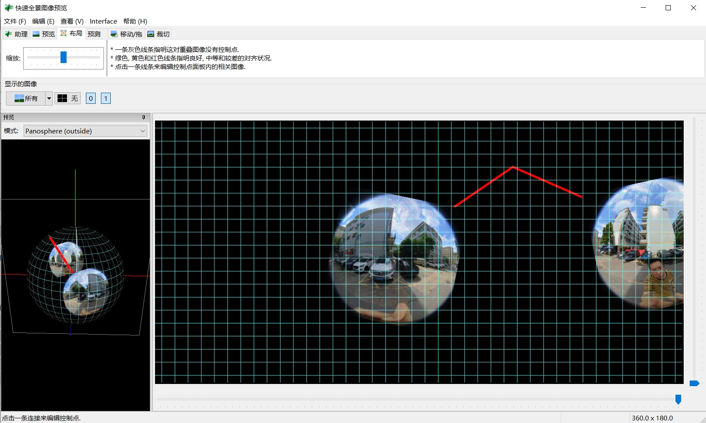
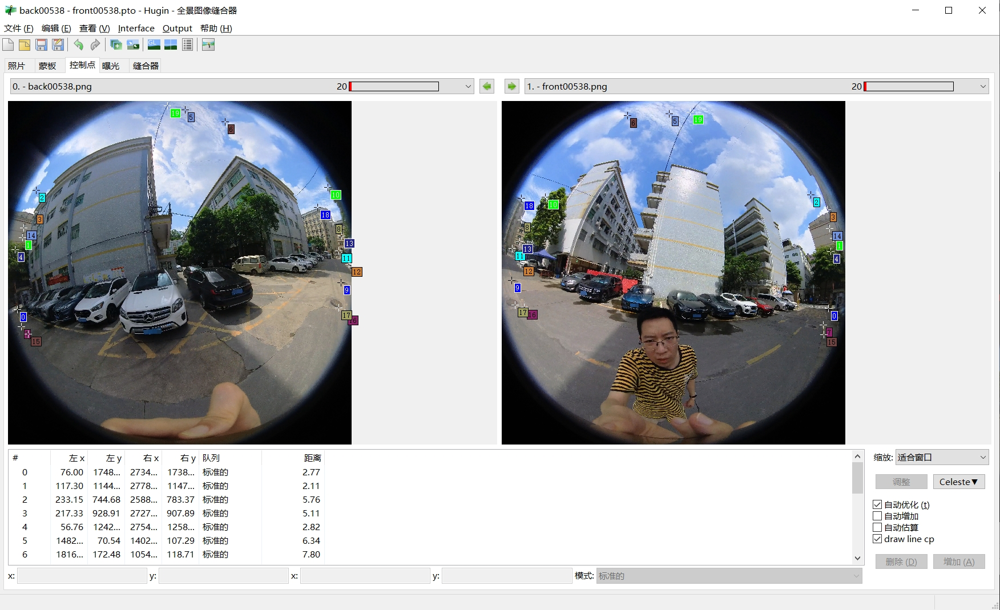
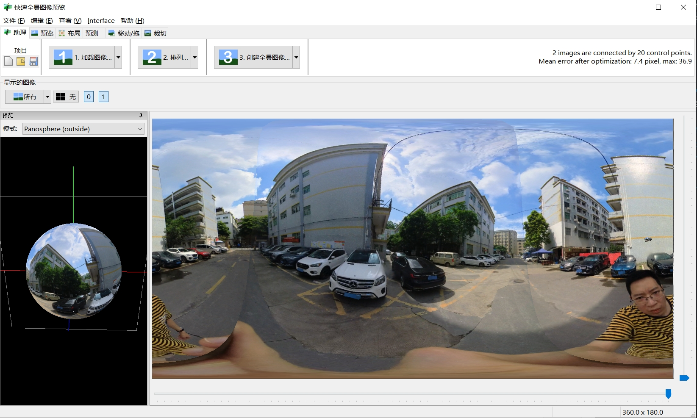

# panorama-hugin

This repository is used for batch generation of panoramic images using [Hugin](https://hugin.sourceforge.io/download/). The advantage is that it directly utilizes the built-in features of the software, without requiring in-depth understanding of the underlying principles, providing a user-friendly panoramic stitching experience.

Input dual-fisheye images:  

| FrontFisheye | BackFisheye |  
|------------- |------------- |  
| |  |  

For the above input dual-fisheye images, import all images into the Hugin stitching software, select matching control points, make necessary parameter adjustments, and output the configuration file `back00538_front00538.pto`. Then, you can use the script `panoStitchingUsingTemplate.py` to produce the following panoramic image.  

  
   
    
 
panorama360
  

  

## Getting Started

1. Open the [Hugin](https://hugin.sourceforge.io/download/) desktop software (available for Windows, Linux, and Mac) to automatically detect and select control points for dual fisheye images, aligning them (i.e., optimizing the stitching within the software). Use the built-in OpenGL to preview the panoramic effect;  

   
   
   

2. Save the project as `*.pto` to your current working directory;  
3. For example,on linux platform, mainly using the [`nona`](https://hugin.sourceforge.io/docs/manual/Nona.html) command for image mapX, mapY mapping, and the [`enblend`](https://hugin.sourceforge.io/docs/manual/Enblend.html) command for blending stitching;  
4. Call `panoStitchingUsingTemplate.py` or `panoStitchingUsingTemplate.sh` to execute the batch panorama stitching.  

For post-processing of panoramas, you can refer to [panorama360Studio](https://github.com/cuixing158/panorama360Studio) or use it for other purposes.  

## References

1. [panorama360Studio](https://github.com/cuixing158/panorama360Studio)  
1. [Hugin - Creating360° enfused panoramas](https://hugin.sourceforge.io/tutorials/enfuse-360/en.shtml)  
1. Hugin Help (offline software help documentation) → Tips and Tricks/scripting
1. <https://medium.com/stereopi/stitching-360-panorama-with-raspberry-pi-cm3-stereopi-and-two-fisheye-cameras-step-by-step-guide-aeca3ff35871>  
1. [How to install Hugin on Ubuntu22.04 (Jammy Jellyfish)](https://askubuntu.com/questions/1404204/how-to-install-hugin-in-ubuntu-22-04-jammy-jellyfish)
